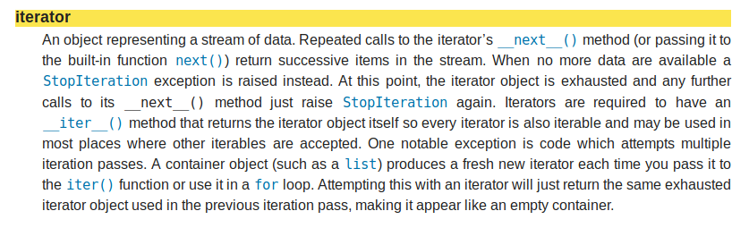
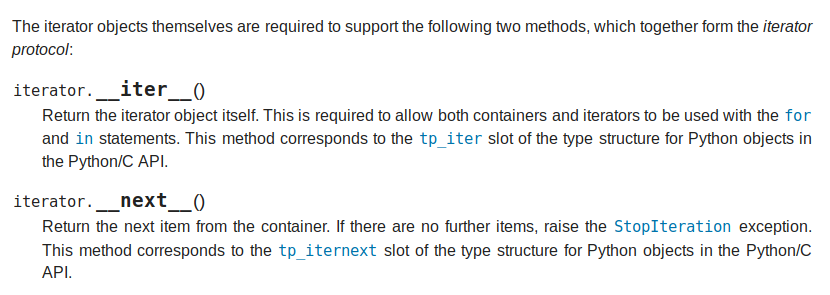

---

# Decortors and Iterators in the wild

## Thibault Ducret & Nicola Luminari

<!--
Speakers note to the best presentation ever
-->

---

# Collection-Based for loop 
we are python coders tell you C buddies to get lost !! 


```python

list_of_stuff = [1, 2, 3, "toto", ("a", 7)]
for item in list_of_stuff:
    print(item)
```

```python
for *var* in *iterable*:
    *statement(s)*
```

{.column}


```python

list_of_stuff = [1, 2, 3, "toto", ("a", 7)]
for i in range(len(list_of_stuff)):
    print(item[i])
```

---

# What is an iterable ? 
An object that can be used in an iteration... umhh
An object that can be passed to the iter()... are you kidding me !?


```python
>>> iter('foobar')                            
<str_iterator object at 0x036E2750>

>>> iter(['foo', 'bar', 'baz'])              
<list_iterator object at 0x036E27D0>

>>> iter(('foo', 'bar', 'baz'))               
<tuple_iterator object at 0x036E27F0>

>>> iter(4.2)                                 
Traceback (most recent call last):
  File "<stdin>", line 1, in <module>
TypeError: 'float' object is not iterable

```

In the axample aboves we pass an *iterable* to the iter() mlethod and we get an *iterator* objec

---

# What is an iterator ?

#


---

# Get elements out of it

```python
>>> it = iter(['what', 'a', 'great', 'meetup' ])
>>> it
<list_iterator object at 0x7f7894892ef0>
>>> next(it)
'what'
>>> next(it)
'a'
>>> next(it)
'great'
>>> next(it)
'meetup'
>>> next(it)
Traceback (most recent call last):
  File "<stdin>", line 1, in <module>
StopIteration

```

---

# Iteration protocol
#


---

# Example

```python
class ImageDataset:
    def __init__(self, photo_directory: str):
        self.images = os.listdir(photo_directory)

    def __iter__(self):
         self.n = 0
        return self
    
    def __next__(self):
        if self.n <= len(self.images):
            self.n += 1
            img = cv.imread(self.images[self.n], 0)
            return img
        else:
            raise StopIteration

    def __len__(self):
        return len(self.images)
```

---

# Under the scenes

```python
for *var* in *iterable*:
    *statement(s)*
```

```python
my_dataset = ImageDatset('~/Documents/cats')
iterator = my_dataset.__iter__()
while True:
    item = iterator.__next__()
    plt.imshow(item)
    plt.show()
```


+ the for loop call the method iter() on the *iterable* object getting an iterator
+ the next() method is called on the iterator getting the *var*
+ repeat next() till _StopIteration_ and exit the for loop

<!--
How can this idiomatic iteration works 
-->

---

# Why iterators ? Design pattern

Decoupling the collection from the algorithm

```python
def length():
    
```

---